1. App: Write the Heroku URL to your app.
```text
https://daiki-transactions3-api-181078cb64c8.herokuapp.com/
```
2. Running my App (Postman): screenshots of using Postman to do the operations as requested in the instructions

### Register User - Success

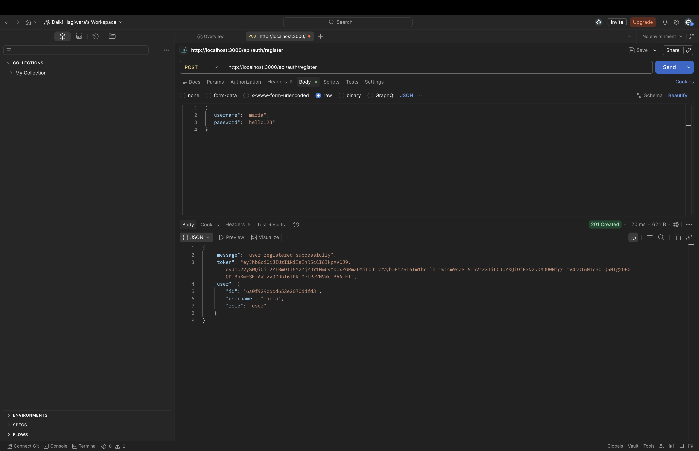

### Register User - Fail

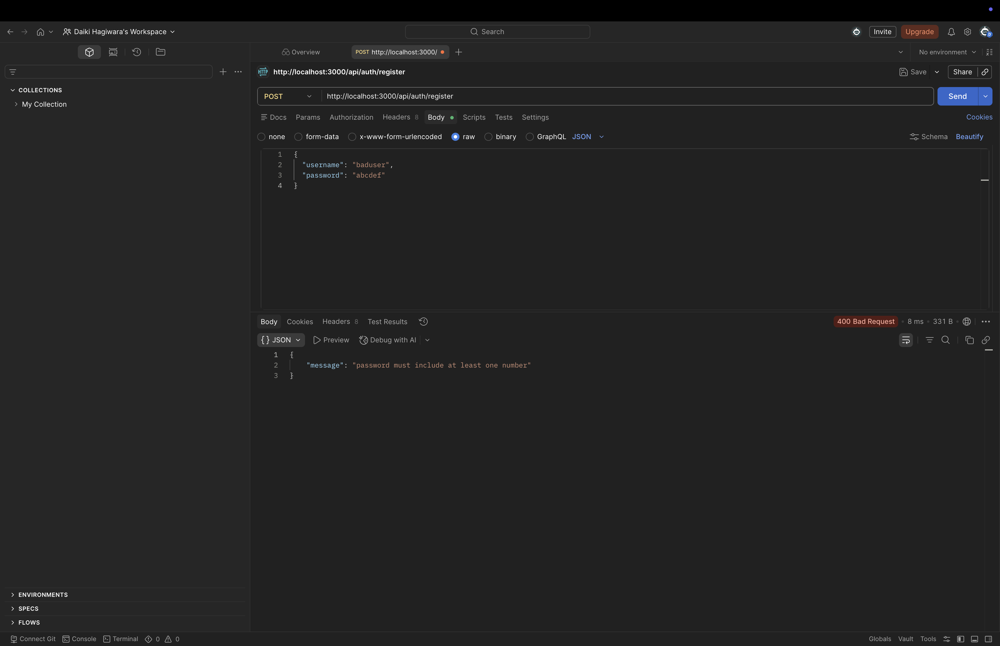

### Login - Local Success 1

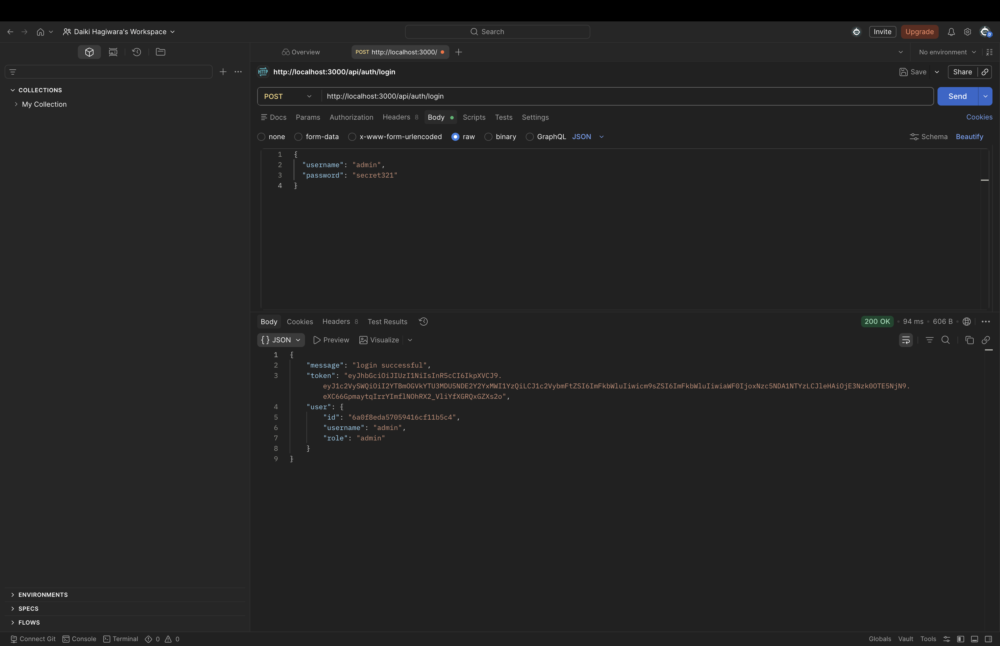

### Login - Local Success 2


### Login - Invalid


### Get Current User - Success

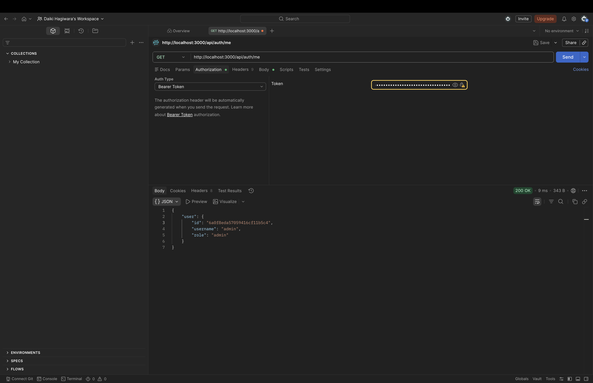

### Get Current User - Token Required


### Change Password

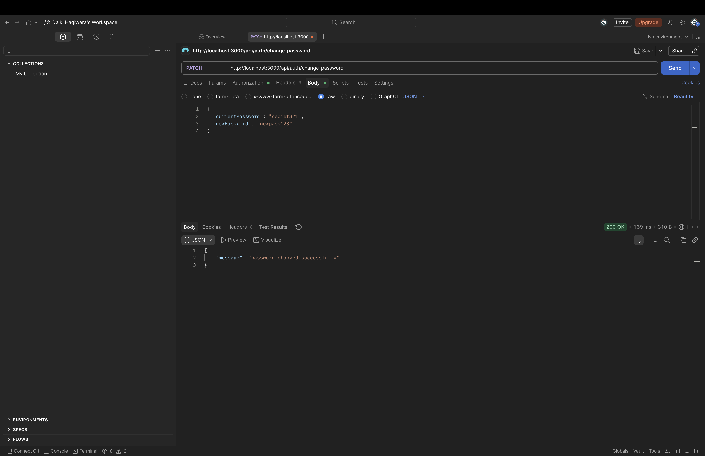

### Create Transaction - Local

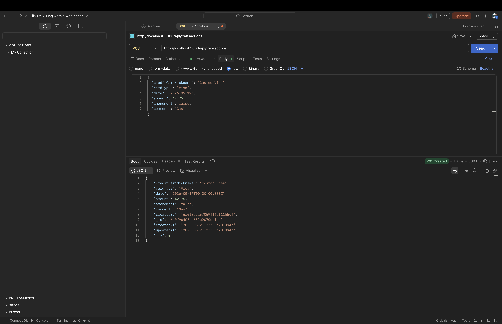

### Create Transaction - Token Required

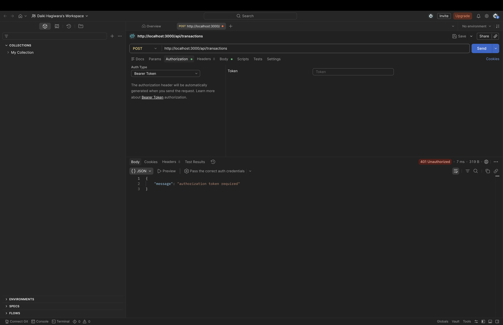

### Get Transactions - Local

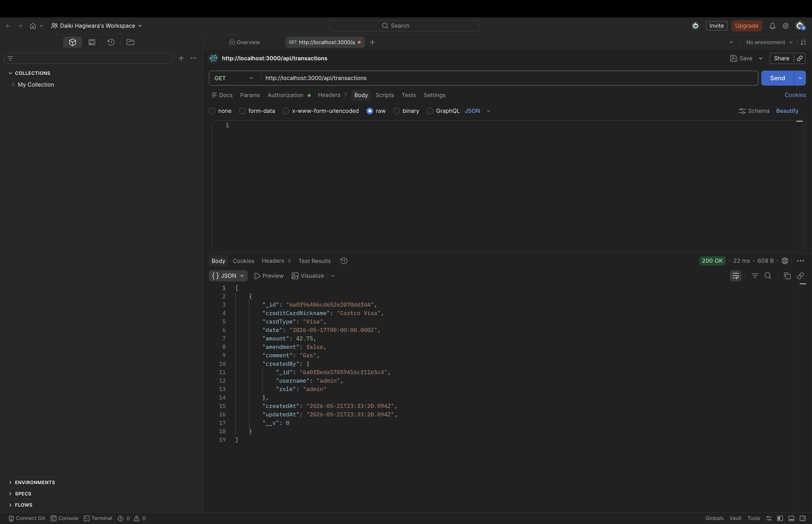

### Get Transaction By ID

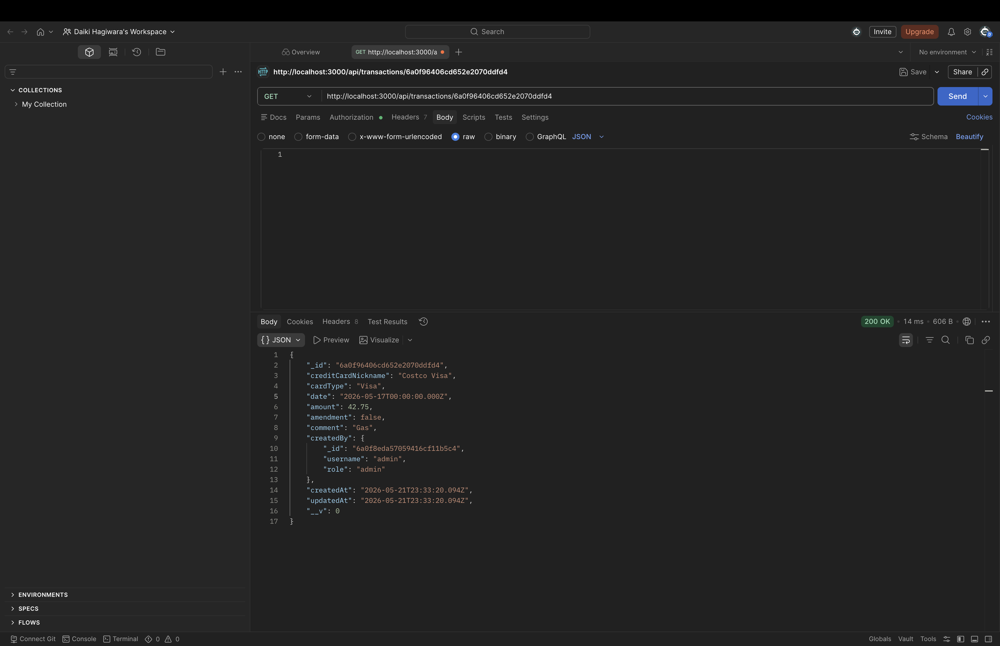

### Login - Heroku

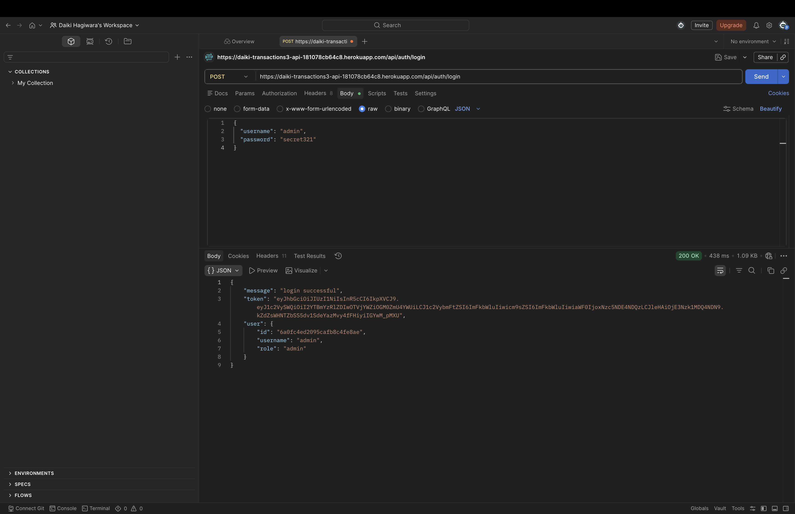

### Create Transaction - Heroku

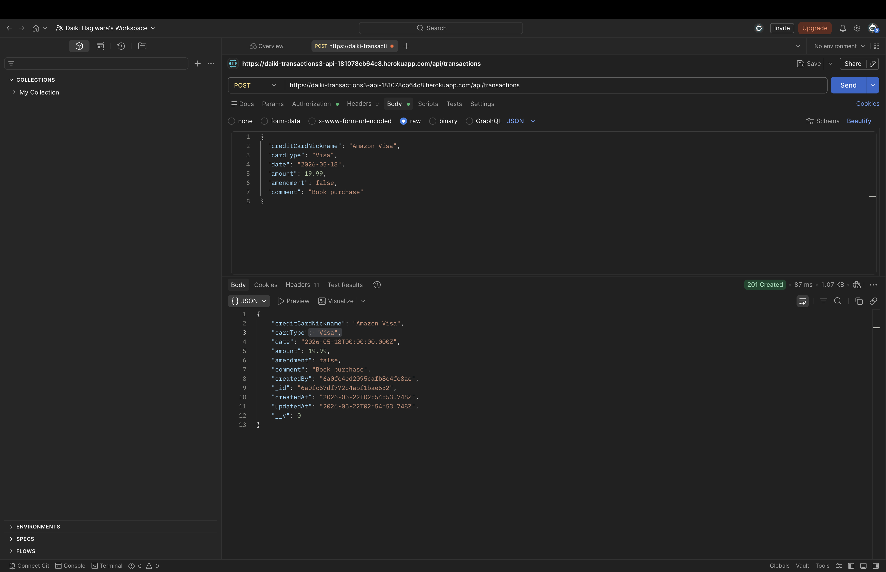

### Get Transactions - Heroku

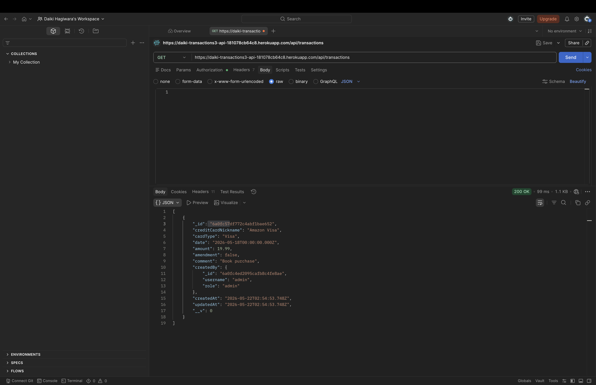

3. Running my App (Browser): screenshots of using the Browser to use your app (Experiment this, if you are unable, write something in challenges below)

### Root Route

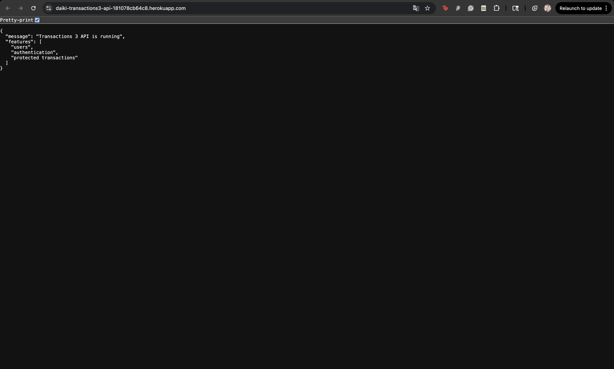

### Protected API Route Without Token

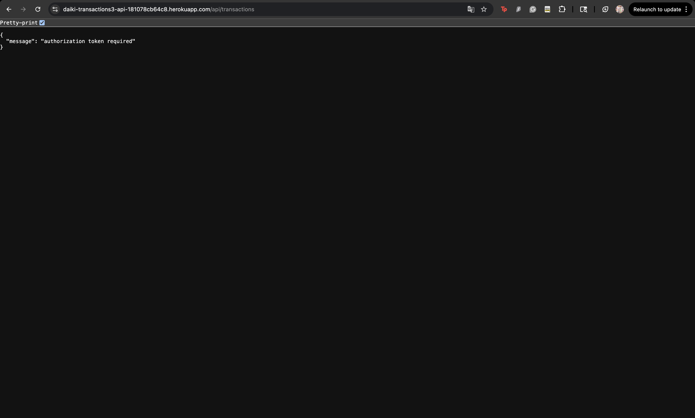

```text
If I try to use the login API directly from the browser address bar, it will not work correctly because the login route needs a request body with the username and password. The browser address bar only sends a simple GET request, so it cannot send the JSON body needed for login. Because of that, I cannot receive a JWT token from the login API using only the browser address bar.

To make this work in a real browser app, the front end would need to send the login request with a JSON body. Then, after the server returns the token, the app could save the token in a cookie or local storage. After that, the app would need to include the token in the Authorization header every time it calls a protected API route.
```

4. Differences: What differences did you note from deploy-app-02-s26 and deploy-app-03-s26?
```text
The main difference between deploy-app-02-s26 and deploy-app-03-s26 is authentication. In deploy-app-02-s26, the app only has transaction routes such as creating and reading transactions. It uses models, controllers, routes, and config files to organize the code. The model talks to the database, the controller handles request and response logic, and the route connects URLs to controller functions.

In deploy-app-03-s26, the app adds users, login, registration, password hashing, JWT tokens, and protected routes. Users must log in before they can create or view transactions. It also adds middleware, so the request flow becomes route → middleware → controller → model → database.

Another difference is the database code. deploy-app-02-s26 uses the normal MongoDB driver with MongoClient, while deploy-app-03-s26 uses Mongoose. The 03 version also has a User model and a Transaction model, and each transaction has a createdBy field connected to a user.
```
5. Models: What model code do you prefer, 02's or 03's? (See models and controllers)
```text
I prefer the model code in deploy-app-03-s26. The 03 version uses Mongoose, so the schema clearly shows the fields, types, required values, and relationships. For example, the transaction has a createdBy field that connects it to a user.

The 02 model is also useful because it shows the MongoDB queries more directly, but 03 feels cleaner and easier to expand.
```
6. Challenges: Write the challenges you faced during this exercise and how you solved them
```text
One challenge was setting up Heroku with MongoDB Atlas. I first had to understand that the local Docker MongoDB URI is only for local development, and Heroku needs the Atlas URI. I solved it by setting the correct MONGODB_URI in Heroku config.
```
7. Questions: Write any questions you still have after this exercise about the code that was here
```text
How long should a JWT token last in a real app?
```